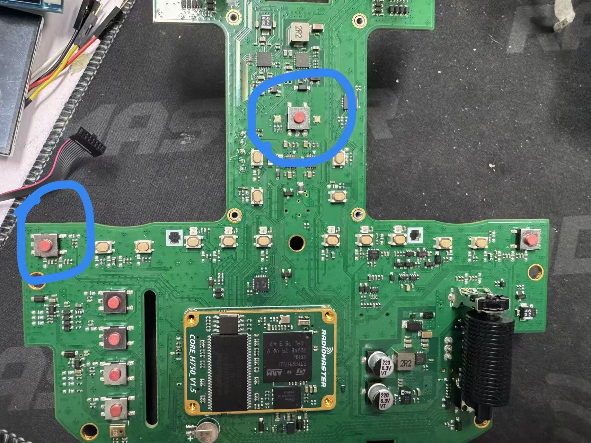
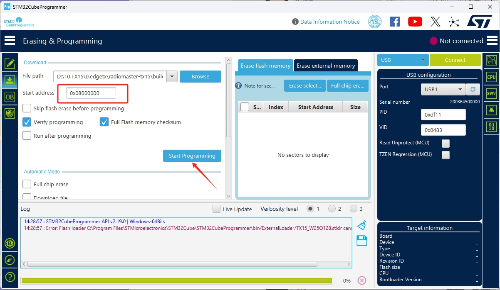
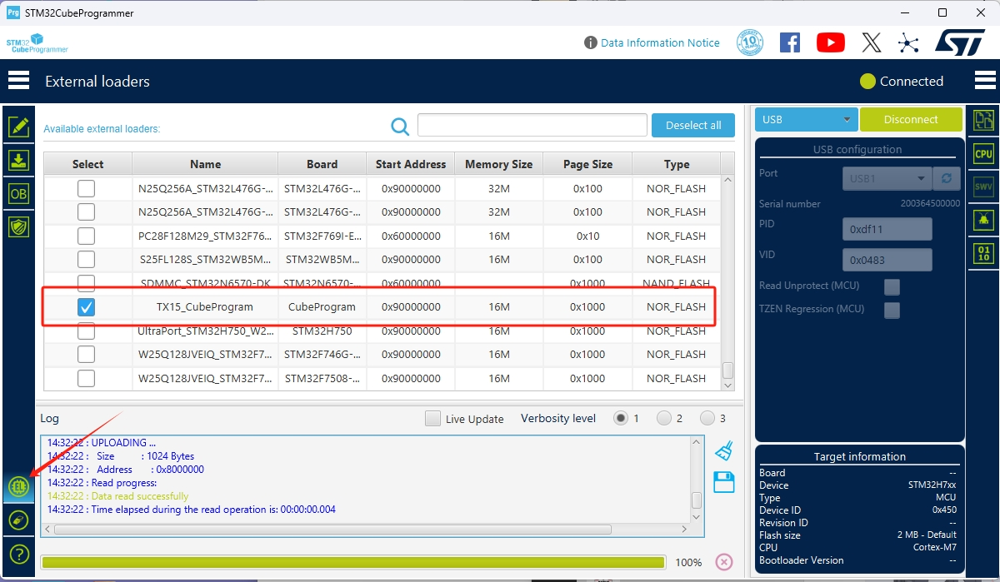
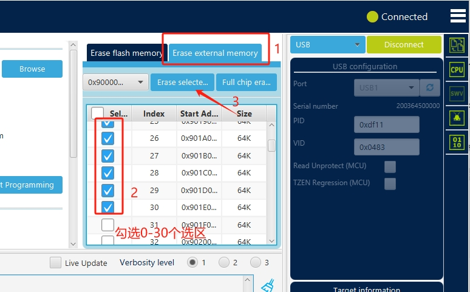
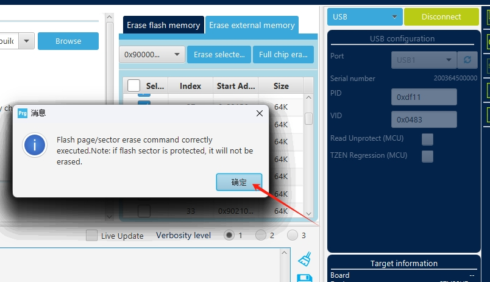
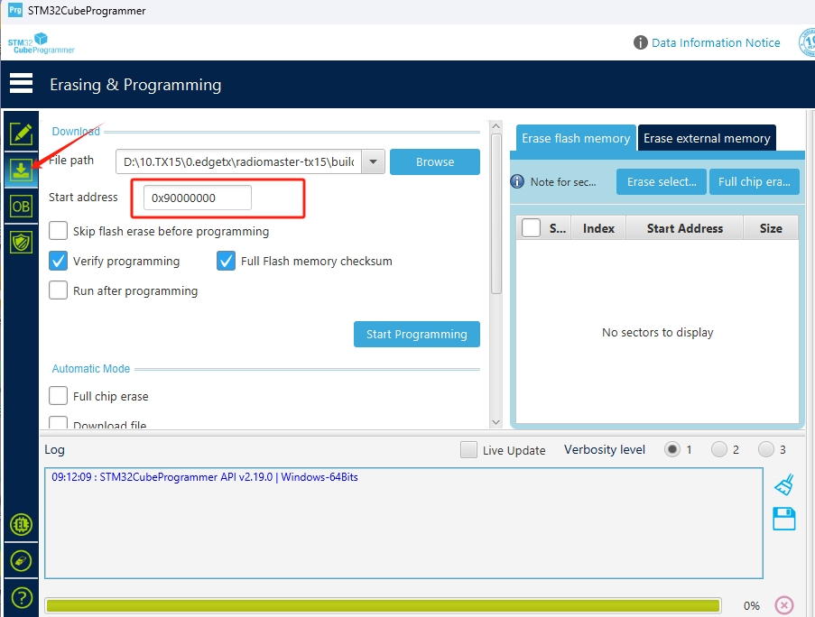
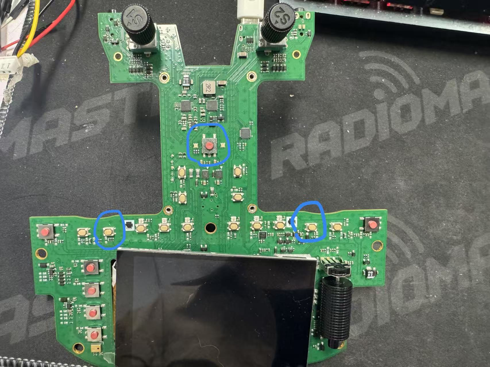
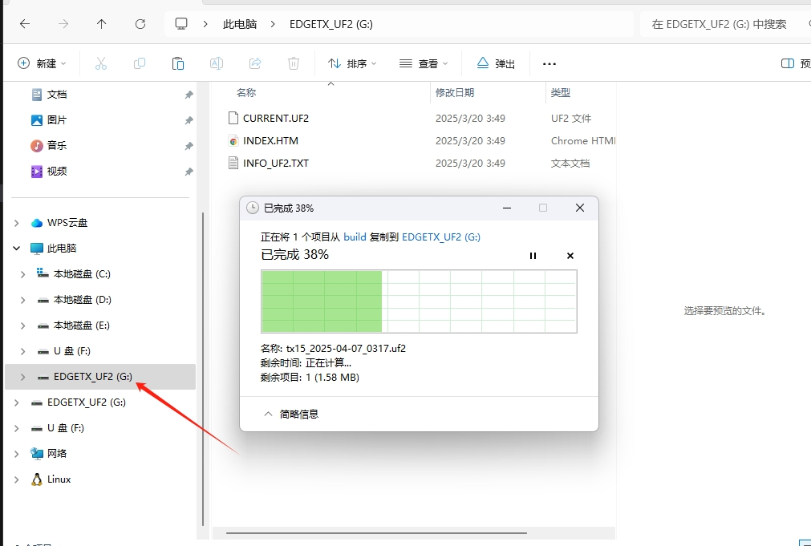

# TX15固件烧录
TX15固件包含 **引导程序** 和 **应用程序** 两部分。

## 1.引导程序烧录
如下图所示，通过长按SYS按键和电源键，插入USB,使芯片进入DFU模式

打开CubeProgramming，选择BootLoader固件，地址选择0x08000000，然后点击开始烧录。

## 2.应用程序烧录
应用程序可以选择用CubeProgramming工具进行烧录，也可以通过UF2文件进行烧录，二选一。
### 2.1.用CubeProgramming工具进行烧录
首先需要把下载算法文件TX15_CubeProgram.stldr复制到CubeProgramming的ExternalLoader目录下，如下图所示

打开CubeProgramming，点击左下角倒数第三个图标，勾选TX15_CubeProgram

往外部Flash写入数据需要先把外部Flash擦除。通过长按组合按键和插入USB,使芯片进入DFU模式。在程序烧录界面，首先点击Erase external memory，然后勾选0-30个区域，点击Erase selected memory 擦除外部Flash。

擦除完成后会有提示，直接点确定。

在程序烧录的界面选择应用程序固件，地址选择0x90000000，然后点击开始烧录。

### 2.2.通过UF2文件进行烧录
插入USB,同时按下如下图所示的3个按键，进入等待升级固件状态。

在电脑资源管理器会多出一个U盘和EDGETX_UF2盘符，把UF2文件复制到EDGETX_UF2盘符中，复制完成后，上电开机即可。

